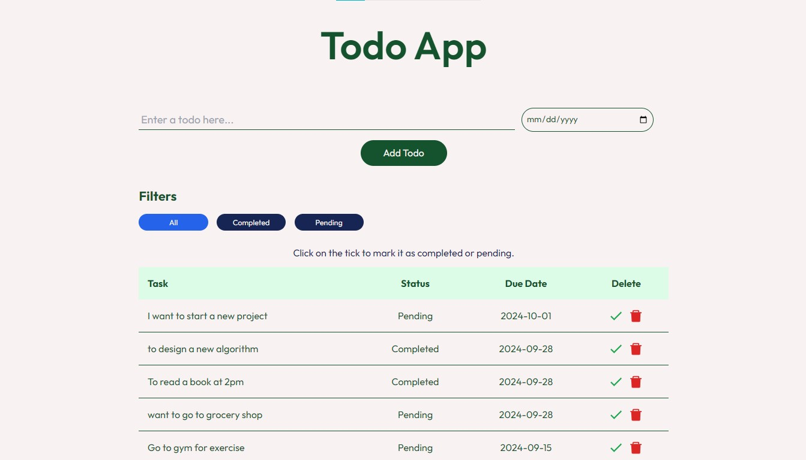

# Full Stack (MERN) Todo App

This is the Full Stack (MERN) Todo App. Redux Toolkit is used as an advanced state management tool for states and maintaining states persistency.

1. You can run this project locally using any hosting platform like Vercel, Netlify and GoDaddy etc. This project is completely protected using environment variables standards. So, you cannot directly host this app as specific keys and database urls have been hidden using environment protocols. But you can fork this repository and clone it into your laptop or pc and fill the environment variables and run it locally on your machine to experience the full potential of this amazing full stack mern todo app.
2. The code is completely efficient and meets the ECMA Script and DSA standards.
3. Host the frontend on hosting platforms like Vercel, Netlify or Godaddy to experience the UI.
4. You can also host your backend data on server as well as on serverless platforms like Vercel and Netlify etc.

# Landing Page

# Tools / Frameworks
1. React.js
2. Redux Toolkit
3. NOde.js
4. Express.js
5. MongoDB
6. Tailwind CSS
7. React-Icons
8. Sonner-Toaster
